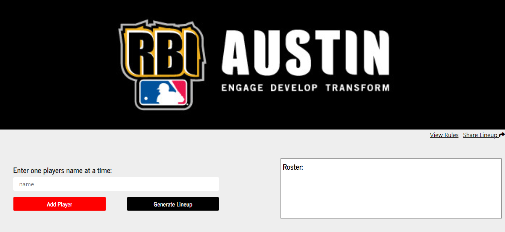

<!-- PROJECT LOGO -->
<br />
<p align="center">
  <h3 align="center">Tee ball Lineup Generator README</h3>
  <br />
  <a align="center" href="https://drive.google.com/file/d/1wMFjBJU7LzEMdPYdizojkkg2OIXKRzZC/view?usp=sharing">View Demo</a>
  ·
  <a align="center" href="https://www.rbiaustintballlineup.com/">Use Live Application Here</a>
</p>


<!-- TABLE OF CONTENTS -->
## Table of Contents

* [About the Project](#about-the-project)
  * [Built With](#built-with)
* [Getting Started](#getting-started)
* [Usage](#usage)
* [Contributing](#contributing)
* [Contact](#contact)
* [Acknowledgements](#acknowledgements)


<!-- ABOUT THE PROJECT -->
## About The Project

[

This application was created to better serve the Tee Ball coaches of RBI Austin. Tee Ball lineups require adhering to some complex rules in order to ensure fair playing time for all kids. These rules however make creating a lineup confusing and time consuming for coaches. Especially when a player doesn't show up to a game or extra players show up causing the coach to have to re-do the lineup. By using this app a coach can now make a lineup in 30 seconds rather than 30 minutes.

The app gives coaches two options.
 
1. The ability to manually enter a lineup via typing and deleting.
 
2. A coach can enter a roster of 1-20 players to generate and regenerate an entire four (4) inning lineup that adheres to the following rules.
 
  - Two (2) inning play rule: Each player must play two defensive innings, including an infield position.
 
  - Special Fielding Rule: Pitcher, First Base, Short Stop, Second Base, cannot play one of these positions in consecutive innings. They must play the outfield, Catcher, Third Base, or be on the bench during the next inning. *Once a player has played one of these 4 positions they cannot return to that same position for the remainder of the game. They may however in an alternate inning play a different one of the 4 preferred positions.
    
  - Bench Rule: With a lineup of thirteen (13) or less players a player must not sit the bench more than one (1) inning.

  - *IF there are 7 or less players added to the roster the lineup will not meet RBI Austin Rules


### Built With

* [React](https://reactjs.org/)
* [JavaScript](https://www.javascript.com/)
* [Bootstrap](https://getbootstrap.com)
* [reactstrap](https://reactstrap.github.io/)
* [immutability-helper](https://www.npmjs.com/package/immutability-helper)
* [react-contenteditable](https://www.npmjs.com/package/react-contenteditable)


<!-- GETTING STARTED -->
## Getting Started

1. Clone the repo
```sh
git clone https://github.com/austingwalker/RBIAustin_Tball_Lineup_Generator.git
```
2. Install NPM packages
```sh
npm install OR yarn install
```
3. Start the application on your local machine
```sh
npm start OR yarn start
```


<!-- USAGE EXAMPLES -->
## Usage

<a href="https://drive.google.com/file/d/1wMFjBJU7LzEMdPYdizojkkg2OIXKRzZC/view?usp=sharing">View Demo Here</a>

_Check out the bulk of the logic code here [Home.js](https://github.com/austingwalker/RBIAustin_Tball_Lineup_Generator/blob/master/src/pages/Home/Home.js)_


<!-- CONTRIBUTING -->
## Contributing

Any contributions you make are **greatly appreciated**.

1. Fork the Project
2. Create your Feature Branch (`git checkout -b feature/NewFeature`)
3. Commit your Changes (`git commit -m 'Add some NewFeature'`)
4. Push to the Branch (`git push origin feature/NewFeature`)
5. Open a Pull Request


<!-- CONTACT -->
## Contact

Austin Walker - [LinkedIn](https://www.linkedin.com/in/austin-walker-aa0aab129/) - agwalker249@gmail.com

Project GitHub Link: [https://github.com/austingwalker/RBIAustin_Tball_Lineup_Generator](https://github.com/austingwalker/RBIAustin_Tball_Lineup_Generator)

Live Application Link: [https://www.rbiaustintballlineup.com/](https://www.rbiaustintballlineup.com/)


<!-- ACKNOWLEDGEMENTS -->
## Acknowledgements
* [GitHub Pages](https://pages.github.com)
* [GoDaddy](https://www.godaddy.com/)
* [Font Awesome](https://fontawesome.com)
